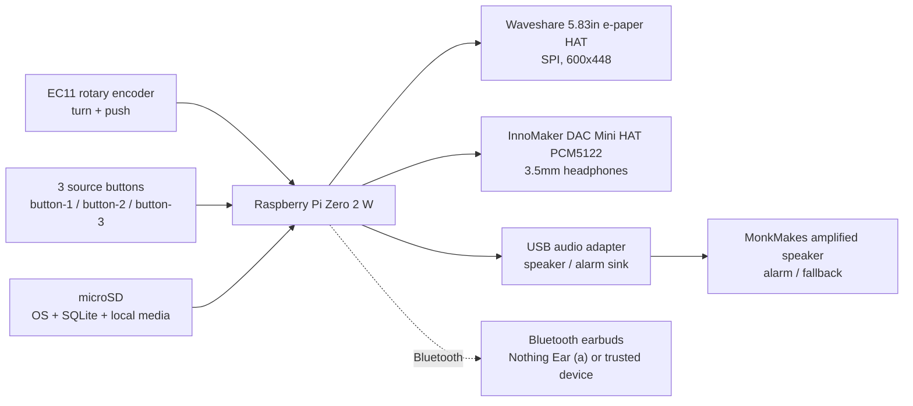

# Raspberry Pi Bring-Up Guide

This is the working hardware bring-up plan for `nightstand-audio`. Treat it as a bench checklist, not final manufacturing documentation. Pin assignments may change once the InnoMaker DAC HAT, e-paper HAT, encoder, buttons, Bluetooth, and USB speaker path are tested together.

## Hardware Target

- Raspberry Pi Zero 2 W with 40-pin header
- Waveshare 5.83inch e-Paper HAT, 600x448, black/white, SPI
- InnoMaker DAC Mini HAT PCM5122 for wired headphones
- USB sound card to MonkMakes amplified speaker for alarm/fallback audio
- Bluetooth earbuds for normal private listening
- EC11 rotary encoder with push button
- Three source buttons mapped to `media/buttons/button-1`, `button-2`, and `button-3`

## GPIO Table

Planned numbering uses BCM GPIO numbers. Physical pin numbers are included to reduce wiring mistakes.

| Function | Device | BCM GPIO | Physical Pin | Direction | Status | Notes |
| --- | --- | ---: | ---: | --- | --- | --- |
| 3.3V | e-paper / controls | n/a | 1 or 17 | Power | Planned | Use for e-paper logic and button pull-ups if needed |
| 5V | Pi / HAT power | n/a | 2 or 4 | Power | Planned | Verify e-paper HAT requirements before sharing |
| Ground | All | n/a | 6, 9, 14, 20, 25, 30, 34, 39 | Ground | Planned | Use common ground |
| SPI MOSI | e-paper | GPIO10 | 19 | Output | Planned | SPI0 MOSI |
| SPI MISO | e-paper | GPIO9 | 21 | Input | Reserved | Often unused by e-paper, but keep SPI0 clean |
| SPI SCLK | e-paper | GPIO11 | 23 | Output | Planned | SPI0 SCLK |
| SPI CE0 | e-paper CS | GPIO8 | 24 | Output | Planned | Waveshare CS |
| EPD DC | e-paper | GPIO25 | 22 | Output | Planned | Data/command pin |
| EPD RST | e-paper | GPIO17 | 11 | Output | Planned | Reset pin |
| EPD BUSY | e-paper | GPIO24 | 18 | Input | Planned | Busy/status pin |
| I2C SDA | HAT EEPROM / DAC | GPIO2 | 3 | Bidirectional | Reserved | Used by HAT ID/I2C; avoid buttons |
| I2C SCL | HAT EEPROM / DAC | GPIO3 | 5 | Bidirectional | Reserved | Used by HAT ID/I2C; avoid buttons |
| I2S BCLK | InnoMaker DAC / audio | GPIO18 | 12 | Output | Reserved | InnoMaker PCM5122 HAT uses I2S/PCM; conflicts with simple GPIO use |
| I2S LRCLK | InnoMaker DAC / audio | GPIO19 | 35 | Output | Reserved | InnoMaker PCM5122 HAT uses I2S/PCM |
| I2S DOUT | InnoMaker DAC / audio | GPIO21 | 40 | Output | Reserved | InnoMaker DAC audio data out |
| I2S DIN | optional audio input | GPIO20 | 38 | Input | Reserved | Keep free for I2S/audio compatibility |
| Encoder A / CLK | EC11 rotary | GPIO5 | 29 | Input | Planned | Pull-up input; debounced in software |
| Encoder B / DT | EC11 rotary | GPIO6 | 31 | Input | Planned | Pull-up input; debounced in software |
| Encoder SW | EC11 push | GPIO13 | 33 | Input | Planned | Short press, double/triple press, long press |
| Button 1 | Source button | GPIO16 | 36 | Input | Planned | Maps to `media/buttons/button-1` |
| Button 2 | Source button | GPIO26 | 37 | Input | Planned | Maps to `media/buttons/button-2` |
| Button 3 | Source button | GPIO27 | 13 | Input | Planned | Maps to `media/buttons/button-3`; long press may cycle sleep timer |
| Spare GPIO | Future | GPIO22 | 15 | Input/Output | Spare | Candidate for frontlight control |
| Spare GPIO | Future | GPIO23 | 16 | Input/Output | Spare | Candidate for future frontlight or output-control experiments |
| UART TX | Debug serial | GPIO14 | 8 | Output | Reserved | Avoid unless serial console intentionally disabled |
| UART RX | Debug serial | GPIO15 | 10 | Input | Reserved | Avoid unless serial console intentionally disabled |

## Known Pin Usage / Collision Notes

- The Waveshare e-paper HAT uses SPI0 plus GPIO pins for `DC`, `RST`, and `BUSY`.
- The InnoMaker PCM5122 DAC HAT uses the Pi audio/I2S pins. Do not assign controls to GPIO18, GPIO19, GPIO20, or GPIO21.
- The speaker / alarm output uses a USB sound card through the Pi Zero USB OTG port, so it does not compete for the InnoMaker DAC HAT's I2S pins.
- The earlier MAX98357A I2S amp idea is replaced for v1. Revisit only if a later enclosure needs a raw passive internal speaker and a separate amp.
- UART pins are left reserved for debugging.
- I2C pins are left reserved for HAT identification and future expansion.

## Wiring Diagrams

### System Block Diagram



### E-Paper SPI Wiring

If the Waveshare HAT is plugged directly into the Pi header, this wiring is handled by the HAT. If using jumpers during bench testing:

```text
Pi 3.3V / 5V / GND -> Waveshare HAT power pins per board labeling
GPIO10 / pin 19     -> DIN / MOSI
GPIO11 / pin 23     -> CLK / SCLK
GPIO8  / pin 24     -> CS
GPIO25 / pin 22     -> DC
GPIO17 / pin 11     -> RST
GPIO24 / pin 18     -> BUSY
GND                 -> GND
```

### Rotary Encoder and Buttons

Use internal pull-ups in software if possible. Wire switches to ground so pressed reads low.

```text
EC11 CLK/A -> GPIO5  / pin 29
EC11 DT/B  -> GPIO6  / pin 31
EC11 SW    -> GPIO13 / pin 33
EC11 GND   -> GND

Button 1 one side -> GPIO16 / pin 36
Button 2 one side -> GPIO26 / pin 37
Button 3 one side -> GPIO27 / pin 13
All button other sides -> GND
```

### Audio Wiring

InnoMaker DAC Mini HAT:

```text
InnoMaker DAC Mini HAT mounts to Raspberry Pi 40-pin header.
Use the InnoMaker 3.5mm jack for wired headphones only.
```

USB speaker / alarm path:

```text
Pi Zero 2 W USB OTG port -> Micro USB OTG adapter -> USB sound card
USB sound card 3.5mm output -> MonkMakes amplified speaker input
```

The USB sound card drives the MonkMakes amplified speaker input. Do not connect a raw passive 4 Ohm speaker directly to the USB sound card.

## First Boot Steps

1. Flash Raspberry Pi OS Lite, Bookworm or newer, to the microSD card.
2. Configure hostname, user, SSH, Wi-Fi, and locale during imaging if possible.
3. Boot the Pi and update packages:

```bash
sudo apt update
sudo apt full-upgrade -y
sudo reboot
```

4. Install baseline tools:

```bash
sudo apt install -y git python3-venv python3-pip sqlite3 \
  mpd mpc pipewire pipewire-pulse wireplumber \
  bluez bluetooth rfkill \
  python3-pil python3-gpiozero python3-lgpio python3-spidev
```

5. Clone the project:

```bash
git clone <repo-url> ~/nightstand-audio
cd ~/nightstand-audio
python3 -m venv .venv
source .venv/bin/activate
pip install -e .
```

6. Seed and render once:

```bash
python -m scripts.seed_library
python -m scripts.render_once
```

## Waveshare E-Paper Setup

Enable SPI:

```bash
sudo raspi-config
```

Choose:

```text
Interface Options -> SPI -> Enable
```

Or set it manually:

```bash
sudo raspi-config nonint do_spi 0
sudo reboot
```

Check SPI devices:

```bash
ls -l /dev/spidev*
```

Expected:

```text
/dev/spidev0.0
/dev/spidev0.1
```

Install/test Waveshare examples separately before integrating with the app:

```bash
cd ~
git clone https://github.com/waveshareteam/e-Paper
cd e-Paper/RaspberryPi_JetsonNano/python
python3 -m venv .venv
source .venv/bin/activate
pip install pillow spidev gpiozero RPi.GPIO
```

Then run the matching 5.83-inch black/white demo from the Waveshare repo. The app adapter uses `from waveshare_epd import epd5in83_V2 as epd5in83`, matching the tested `epd5in83_V2` driver path.

App integration target:

- Keep all Waveshare code inside `app/display/waveshare_display.py`.
- The app renderer now targets `600x448`.
- The adapter converts each Pillow image with `.convert("1")`, resizes/rotates if needed, and pushes it to the display.
- Appliance live mode initializes the display once and leaves it awake during the simulator session.
- On shutdown or Ctrl+C, the display adapter calls `sleep()` again as a safe cleanup.

Live display mode:

```bash
cd ~/nightstand-audio
source .venv/bin/activate
GPIOZERO_PIN_FACTORY=lgpio python -m scripts.run_live_epd
```

Equivalent manual form:

```bash
USE_REAL_EPD=true GPIOZERO_PIN_FACTORY=lgpio python -m scripts.run_simulator
```

Useful environment:

```text
USE_REAL_EPD=true
FORCE_EPD_UPDATE=false
EPD_REINIT_EVERY_UPDATE=false
CLEAR_BEFORE_EPD_UPDATE=false
GPIOZERO_PIN_FACTORY=lgpio
NIGHTSTAND_DISPLAY_WIDTH=600
NIGHTSTAND_DISPLAY_HEIGHT=448
NIGHTSTAND_EPD_ROTATE=0
CLEAR_EPD_ON_EXIT=false
EPD_FULL_CLEAR_INTERVAL=50
EPD_RENDER_DEBOUNCE_MS=750
EPD_VOLUME_REFRESH_DEBOUNCE_MS=2000
EPD_REFRESH_ON_VOLUME_CHANGE=false
EPD_PARTIAL_UPDATE_ENABLED=true
EPD_DISABLE_PARTIAL=false
EPD_ONE_SHOT_MAJOR_TRANSITIONS=true
EPD_REGION_PARTIAL_ENABLED=true
EPD_PARTIAL_STREAK_LIMIT=8
EPD_PARTIAL_REFRESH_MIN_INTERVAL_MS=500
EPD_FORCE_FULL_REFRESH=false
EPD_FORCE_CLEAN_REFRESH=false
EPD_CLOCK_REFRESH_SECONDS=60
EPD_DISABLE_CLOCK_AUTO_REFRESH=false
WAVESHARE_EPD_PYTHON_PATH=/home/pi/e-Paper/RaspberryPi_JetsonNano/python
```

E-paper retains the last image after sleep. Live mode sleeps the display on exit without clearing by default and logs `Display sleeping; last image remains visible by design.` To clear on exit, set `CLEAR_EPD_ON_EXIT=true`.

Manual clear:

```bash
GPIOZERO_PIN_FACTORY=lgpio python -m scripts.clear_epd
```

Push the latest PNG once through the live adapter:

```bash
GPIOZERO_PIN_FACTORY=lgpio python -m scripts.push_latest_epd
GPIOZERO_PIN_FACTORY=lgpio python -m scripts.push_latest_epd --full
```

The live adapter uses `epd5in83_V2`, initializes the display once at startup, keeps it awake during the simulator session, and calls `sleep()` on shutdown. Each physical update opens `data/latest_screen.png`, converts to 1-bit, and resizes to `epd.width`/`epd.height`.

Full updates run in true full mode with `epd.init()` and `epd.display(epd.getbuffer(img))`. Partial updates run in partial mode with `init_Part()` and `display_Partial()` when those methods are present in the installed Waveshare driver. Major clean transitions switch from partial mode back to full mode before `Clear()` and `display()`, which avoids the muddy mixed-screen artifacts caused by using the partial LUT for full-looking updates.

`EPD_ONE_SHOT_MAJOR_TRANSITIONS=true` is the current default for major transitions. It matches the working manual push lifecycle: create a fresh `epd5in83_V2.EPD()`, call `init()`, open `data/latest_screen.png`, convert to 1-bit, resize to `epd.width`/`epd.height`, call `display(epd.getbuffer(img))`, then call `sleep()`. The display scheduler cancels pending debounced physical updates before this one-shot push so a stale queued frame cannot immediately overwrite the transition.

Partial updates are only allowed for same-layout changes after a clean screen is already displayed. HOME-to-MENU, MENU-to-HOME, HOME-to-SLEEP_TIMER, source/track-list changes, and title/layout changes use full clean refreshes to avoid mixed stale regions. One exception is switching playlists while already on the playback home layout; that can use a `main_content` partial refresh because the clock and bottom status row remain stable. Same-layout partial refresh requests carry named dirty regions (`clock`, `main_content`, `bottom_bar`, `menu_list`, `sleep_timer_value`). The current 5.83 V2 driver path logs `region_emulated=true` when the installed driver only supports full-buffer partial refresh.

`EPD_REINIT_EVERY_UPDATE=false` is the appliance default. Set it to `true` only for hardware debugging if you need the old bring-up behavior.

`CLEAR_BEFORE_EPD_UPDATE=false` is the default. Set it to `true` only if you intentionally want `Clear()` before every forced display write.

`EPD_RENDER_DEBOUNCE_MS=750` coalesces rapid sequential state changes into one physical display write. Volume changes skip physical e-paper updates by default with `EPD_REFRESH_ON_VOLUME_CHANGE=false`; if enabled, `EPD_VOLUME_REFRESH_DEBOUNCE_MS=2000` waits until knob movement settles before pushing the final value. `EPD_PARTIAL_REFRESH_MIN_INTERVAL_MS=500` prevents rapid partial-refresh bursts. `EPD_PARTIAL_STREAK_LIMIT=8` forces a clean full refresh after eight consecutive partial updates. `EPD_CLOCK_REFRESH_SECONDS=60` prevents second-by-second e-paper refreshes, and `EPD_DISABLE_CLOCK_AUTO_REFRESH=true` disables automatic clock refreshes entirely.

Set `EPD_DISABLE_PARTIAL=true` if partial refresh artifacts show up during real use and you want to avoid `init_Part()` / `display_Partial()` entirely. Set `EPD_PARTIAL_UPDATE_ENABLED=false` to keep app policy from requesting partial updates.

Ghosting/artifact notes:

- Appliance live mode does not clear before every display write unless `CLEAR_BEFORE_EPD_UPDATE=true`.
- Periodic clean refreshes can still run every `EPD_FULL_CLEAR_INTERVAL` renders, default `50`.
- A clean full refresh is forced after 8 partial refreshes or when the policy switches from partial back to full.
- Set `EPD_FULL_CLEAR_INTERVAL=0` to disable periodic clears.

## InnoMaker DAC Setup

The InnoMaker DAC Mini HAT PCM5122 path is for wired headphone output.

Check current audio devices:

```bash
aplay -l
aplay -L
wpctl status
```

Raspberry Pi audio HAT overlays vary by board revision. Validate the exact InnoMaker DAC Mini HAT PCM5122 overlay/configuration against the board documentation before finalizing `/boot/firmware/config.txt` on Bookworm. Do not assume the old official DAC+ / IQaudio overlay is correct without testing it on this board.

Useful checks:

```bash
grep -n "dtoverlay" /boot/firmware/config.txt
dmesg | grep -i -E "audio|snd|pcm5122|innomaker|hifiberry|dac"
aplay -l
speaker-test -t wav -c 2
```

MPD should eventually target the chosen DAC/PipeWire sink through `MPDPlayer`, not through controller logic.

## USB Sound Card / Speaker Setup

The USB sound card plus MonkMakes amplified speaker is the v1 speaker path for alarm and fallback audio. It connects through the Pi Zero 2 W USB OTG port and should appear as a separate ALSA/PipeWire device from the InnoMaker DAC HAT.

Plug in the USB adapter through the OTG adapter, then check detection:

```bash
lsusb
aplay -l
aplay -L
wpctl status
pactl list short sinks
```

Test the adapter directly:

```bash
speaker-test -D plughw:<card>,<device> -t wav -c 2
```

Replace `<card>,<device>` with the card/device numbers shown by `aplay -l`.

Expected routing:

- InnoMaker DAC HAT: private wired headphones.
- USB sound card -> MonkMakes amplified speaker: alarm fallback output.
- Bluetooth: private wireless listening when connected.

Do not connect a raw passive 4 Ohm speaker directly to the USB sound card. The v1 path uses the MonkMakes amplified speaker.

## PipeWire Setup

Raspberry Pi OS Bookworm uses modern Linux audio plumbing. Keep the app decoupled from ALSA/PipeWire details by routing output inside playback/output adapters.

Inspect audio services:

```bash
systemctl --user status pipewire pipewire-pulse wireplumber
wpctl status
pactl info
pactl list short sinks
```

Set a default sink for normal playback:

```bash
wpctl status
wpctl set-default <sink-id>
```

Debug output routing:

```bash
pw-top
pw-cli ls Node
pactl list sinks
journalctl --user -u pipewire -u wireplumber --since "10 min ago"
```

Planned app behavior:

- normal playback can route to Bluetooth or the InnoMaker DAC,
- USB sound card to MonkMakes speaker is the alarm/fallback sink,
- alarm output does not depend on earbuds or headphones being connected.

## Bluetooth Pairing

Bluetooth is planned for Raspberry Pi deployment, not required for the Mac simulator.

Pair and trust earbuds:

```bash
bluetoothctl
power on
agent on
default-agent
scan on
pair <MAC_ADDRESS>
trust <MAC_ADDRESS>
connect <MAC_ADDRESS>
scan off
quit
```

Check connection and audio sink:

```bash
bluetoothctl devices
bluetoothctl info <MAC_ADDRESS>
pactl list short sinks
wpctl status
```

Reconnect workflow target:

1. User triple-clicks any source button.
2. App opens a reconnect window for about 30 seconds.
3. Pi attempts reconnect to the trusted earbuds.
4. If connected, normal playback switches to Bluetooth and UI shows `Connected: <device>`.
5. If not found, UI shows `Earbuds Not Found` and preserves the previous sink.

Implementation TODOs:

- Use `bluetoothctl` or BlueZ DBus APIs for reconnect.
- Use PipeWire/PulseAudio to detect the Bluetooth sink.
- Persist `preferred_output = bluetooth` when the user selects earbuds.
- Keep reconnect device-level, not source-specific.
- Keep alarm routed to the USB sound card -> MonkMakes speaker sink by default.

## Debugging Commands

System:

```bash
uname -a
cat /etc/os-release
vcgencmd measure_temp
vcgencmd get_throttled
df -h
free -h
```

GPIO / overlays:

```bash
pinout
raspi-gpio get
gpioinfo
ls -l /dev/spidev*
grep -n "dtparam\|dtoverlay" /boot/firmware/config.txt
```

Audio:

```bash
lsusb
aplay -l
aplay -L
wpctl status
pactl list short sinks
speaker-test -t wav -c 2
```

Bluetooth:

```bash
rfkill list
systemctl status bluetooth
bluetoothctl show
bluetoothctl devices
bluetoothctl info <MAC_ADDRESS>
journalctl -u bluetooth --since "10 min ago"
```

App:

```bash
cd ~/nightstand-audio
source .venv/bin/activate
python -m scripts.seed_library
python -m scripts.render_once
python -m scripts.run_simulator
GPIOZERO_PIN_FACTORY=lgpio python -m scripts.run_live_epd
GPIOZERO_PIN_FACTORY=lgpio python -m scripts.clear_epd
GPIOZERO_PIN_FACTORY=lgpio python -m scripts.push_latest_epd
sqlite3 data/nightstand.sqlite ".tables"
sqlite3 data/nightstand.sqlite "select source_id, title, completed, last_position_seconds from media_items limit 20;"
```

MPD:

```bash
systemctl status mpd
mpc status
mpc outputs
journalctl -u mpd --since "10 min ago"
```

## Bring-Up Order

1. Boot Pi with no HATs attached; confirm SSH and package install.
2. Enable SPI; attach Waveshare HAT; run Waveshare demo.
3. Attach InnoMaker DAC Mini HAT; validate the exact overlay/config and confirm headphone output with `speaker-test`.
4. Confirm PipeWire sink list and default output switching.
5. Attach USB sound card through the OTG adapter; confirm it appears as a separate audio sink.
6. Test USB sound card output into the MonkMakes amplified speaker.
7. Pair Bluetooth earbuds; confirm sink appears and can play audio.
8. Wire encoder and buttons on a breadboard; test raw GPIO reads.
9. Run the app with keyboard input first.
10. Run `GPIOZERO_PIN_FACTORY=lgpio python -m scripts.run_live_epd` and verify keyboard-driven screen changes refresh the physical e-paper display live.
11. Implement and test GPIO input adapter.
12. Confirm alarm routes to the USB sound card -> MonkMakes speaker sink while normal playback can switch between Bluetooth and the InnoMaker DAC.

## References

- [Raspberry Pi hardware documentation](https://www.raspberrypi.com/documentation/hardware/raspberrypi/)
- [Raspberry Pi audio accessories documentation](https://www.raspberrypi.com/documentation/accessories/audio.html)
- [Waveshare 5.83inch e-Paper HAT manual](https://www.waveshare.com/wiki/5.83inch_e-Paper_HAT_Manual)
- [Waveshare e-Paper example repository](https://github.com/waveshareteam/e-Paper)
